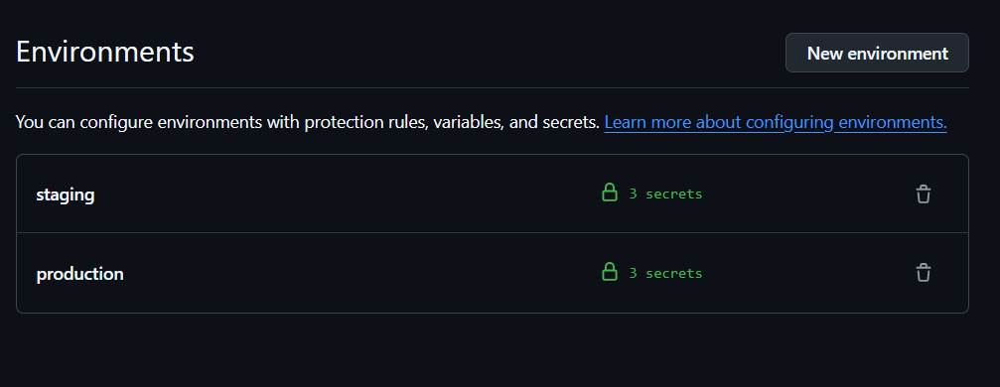
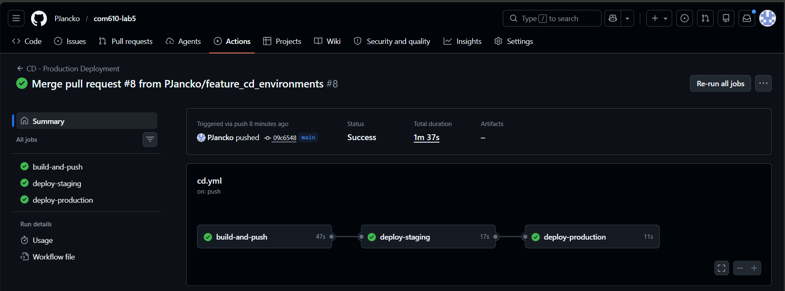
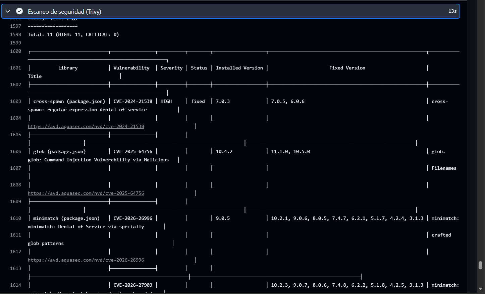
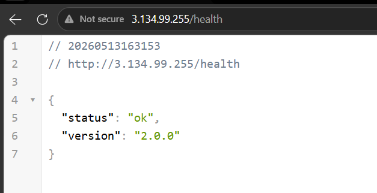

# Informe de Laboratorio 5.2: Pipeline de Despliegue Continuo con Docker 🐳

**Estudiante:** Pablo Alejandro Jancko Gallardo 
**Materia:** Trabajando en la Nube (COM610)  
**Fecha:** 13 de mayo de 2026  

---

## 1. Descripción del Pipeline de CD y Decisiones Técnicas

Se ha implementado un pipeline de **Despliegue Continuo (CD)** automatizado utilizando **GitHub Actions**, **Docker** y **Amazon EC2**. El flujo está diseñado para garantizar que el código que llega a la rama `main` sea seguro, esté empaquetado correctamente y se despliegue sin intervención manual.

### Decisiones Técnicas:
* **Docker Multi-stage Build:** Se utilizó una estrategia de construcción en varias etapas para separar el entorno de compilación del entorno de ejecución. Esto permite que la imagen final sea liviana (usando `node:20-alpine`) y no contenga herramientas de desarrollo innecesarias, mejorando la seguridad y velocidad de descarga.
* **GitHub Environments:** Se configuraron dos entornos (**Staging** y **Production**) para separar las credenciales de los servidores. Esto permite validar cambios en una instancia de pruebas antes de impactar el entorno productivo.
* **Estrategia de Tagging (SHA):** Cada imagen subida a Docker Hub se etiqueta con el `GITHUB_SHA` único del commit. Esto permite una trazabilidad total entre el código fuente y el contenedor en ejecución.
* **Health Checks:** El proceso de despliegue incluye una validación de salud en el puerto 3001 antes de realizar el cambio de tráfico al puerto 80, evitando el despliegue de versiones "rotas".

---

## 2. Configuración de Entornos (Environments)

Para este proyecto, se implementó una segregación de entornos utilizando **GitHub Environments**, lo que permite una gestión de secretos y estados de despliegue independiente para cada etapa del ciclo de vida.

### Entorno: Staging (Pruebas)
* **Propósito:** Actúa como un entorno de pre-producción o "espejo".
* **Función en el Pipeline:** Es la primera parada del código tras superar las pruebas de CI. Aquí se despliega la aplicación en una instancia EC2 dedicada para realizar pruebas de integración y validación final en un entorno real pero controlado.
* **Seguridad:** Utiliza sus propias credenciales SSH, permitiendo que el equipo de QA o el desarrollador verifique los cambios sin riesgo de afectar a los usuarios finales.

### Entorno: Production (Producción)
* **Propósito:** Es el entorno orientado al usuario final.
* **Función en el Pipeline:** Solo se activa si el despliegue en Staging fue exitoso. Representa la versión estable y oficial de la aplicación.
* **Seguridad:** Este entorno cuenta con reglas de protección adicionales. En un flujo real, se configuró para requerir el éxito previo de Staging y el uso de imágenes etiquetadas, garantizando que solo código validado y escaneado por Trivy llegue al servidor principal.



## 3. Evidencias del Workflow en GitHub Actions

El pipeline consta de tres fases críticas: Construcción, Despliegue en Staging y Despliegue en Producción.


*(Captura del grafo de Actions mostrando los tres jobs interconectados exitosamente)*

---

## 4. Escaneo de Vulnerabilidades (Seguridad)

Como parte del compromiso con la seguridad, se integró **Trivy** en el pipeline. Este escanea la imagen Docker buscando vulnerabilidades conocidas (CVE) en las librerías del sistema y de Node.js.


*(Captura de la tabla de vulnerabilidades generada por Trivy en los logs de Actions)*

---

## 5. Aplicación Funcionando en Instancia Remota

La API se encuentra desplegada exitosamente en AWS EC2. Se puede verificar el funcionamiento a través del endpoint de salud.

* **URL de Producción:** `http://http://3.134.99.255/health`
* **Respuesta esperada:** `{"status": "ok", "version": "2.0.0"}`


*(Captura del navegador mostrando la respuesta JSON desde la IP de AWS)*

---

## 6. Procedimiento de Rollback

En caso de detectar un error crítico en producción que el Health Check no haya filtrado, se puede realizar un **Rollback Manual** inmediato siguiendo estos pasos desde la terminal de la instancia EC2:

1.  Identificar el SHA del commit de la versión estable anterior en GitHub.
2.  Ejecutar el despliegue de la imagen previa:
```bash
# Ejemplo de comandos ejecutados en el servidor
docker pull pjancko/com610-lab5.2:[SHA_ESTABLE]
docker stop app-prod
docker rm app-prod
docker run -d --name app-prod --restart unless-stopped -p 80:3000 pjancko/com610-lab5.2:[SHA_ESTABLE]
```

## 7. Reflexión: Ventajas de Contenedores y CD en Proyectos Reales

La implementación de este pipeline demuestra cómo la arquitectura moderna de software soluciona problemas críticos de fiabilidad y escalabilidad. A continuación, las principales ventajas observadas:

* **Eliminación del sesgo del entorno ("En mi máquina funciona"):** Gracias a Docker, el entorno de ejecución está definido por código. Esto garantiza que la aplicación se comporte de manera idéntica en la laptop de desarrollo (i5 con 8GB), en el entorno de Staging y en las instancias EC2 de producción.
* **Velocidad de entrega (Time-to-Market):** El despliegue continuo (CD) permite que las nuevas funcionalidades o correcciones lleguen al usuario final en minutos. Al automatizar el build, el escaneo de seguridad y el despliegue, el equipo de ingeniería puede centrarse en escribir código en lugar de gestionar servidores.
* **Seguridad y Resiliencia:** La integración de herramientas como **Trivy** asegura que no se desplieguen imágenes con vulnerabilidades críticas conocidas. Además, el uso de **Health Checks** automáticos actúa como una red de seguridad, manteniendo la versión anterior estable si la nueva versión presenta fallos de arranque.
* **Eficiencia de Recursos:** El uso de imágenes *multi-stage* y distribuciones ligeras (Alpine) optimiza el uso del SSD de 500GB y la memoria RAM de las instancias, permitiendo ejecutar múltiples servicios de forma aislada y eficiente.

En conclusión, el despliegue continuo con contenedores no es solo una comodidad, sino una necesidad estratégica para cualquier proyecto que busque ser robusto, seguro y capaz de evolucionar rápidamente en la nube.